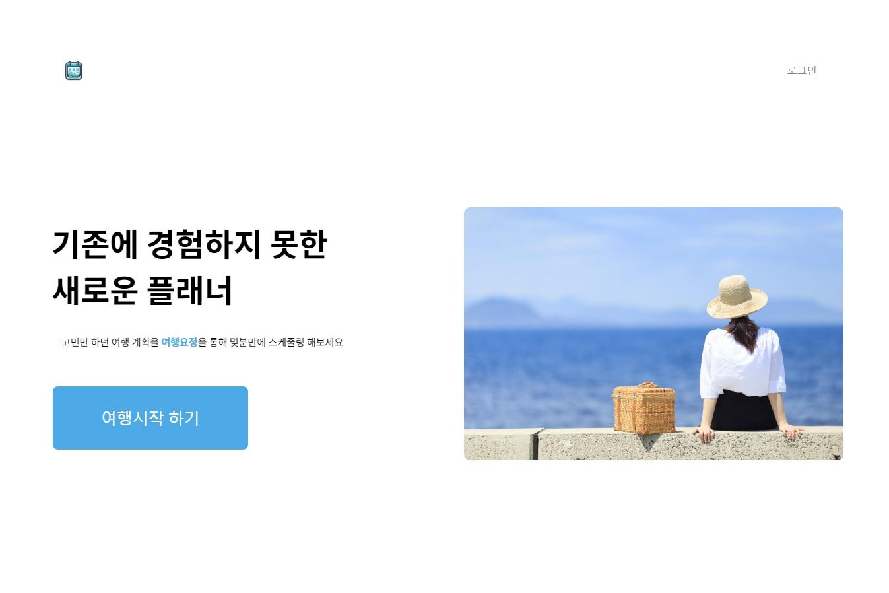

# Trip_Fixied 여행계획 도움 서비스

 > ## ✔    개발인원 , 개발기간 및 역할 
    개발인원 : 기존 4명 (프론트엔드 2명, 백엔드 2명) -> 최종 2명 (프론트엔드 1명, 백엔드 1명)

    역할 담당 : 프론트엔드 담당(팀장)
    개발기간 : 2023.12.30 ~ 2024.02.02

    

 

 > ## ✍ 사용된 기술 스택  

### Front-End

 

 
 

### Back-End

### ETC

 

> ## 🖐 프로젝트 소개

**Trip_Fixied 는 사용자의 여행 일정에 맞춰 관광지, 축제 정보, 숙소 등 다양한 선택지를 제공하여 여행 일정을 계획하고 비교하는 데 도움을 주는 서비스입니다**

 여행지를 정하고 나서도 어떤 활동을 할지 모르거나, 해당 지역의 관광 정보를 찾기 어려운 경우가 많습니다.  
 저 또한 여행을 계획할 때 이러한 불편함을 겪어봤었고, 누군가가 추천해주는 시스템이 있다면  어떨까라는 고민과 함께 개발하게 되었습니다. 

 

> ## ✨ 프로젝트 핵심 기능

 1. TourAPI(4.0)를 활용하여 여행 일정에 맞춰 관광지,축제,숙소 상세정보를 제공

 2. 제공된 장소의 위치정보를 Naver Maps API를 활용해 장소 표시

 3. 여행 일정 기간 동안 OpenWeatherAPI를 통해 날씨정보 제공

 4. 세워둔 여행계획을 마이리스트에 저장 후 비교 가능하도록 구현

 

> ## ⭐ 프로젝트 기여도
 1. **페이지 전환 애니메이션 구현**
    - SPA로 구성된 React 프로젝트에서, 페이지가 하나로 구성되어있으니 페이지 전환 시 애니메이션 적용이 가능한지 고민
    - 구글링을 통해 `Framer Motion`을 사용해 이를 구현할 수 있음을 알게 되었습니다.
    - 페이지 전환 애니메이션 적용이 가능한 이유는 React는 컴포넌트 기반 구조를 가지고 있어, 페이지 이동 시 컴포넌트를 렌더링하는 과정에서 애니메이션 적용이 가능했던 것
    - SPA에서는 페이지 이동 시 새로운 페이지를 로드하지 않고, 현재 페이지의 내용이 교체되거나 갱신되는 방식으로, DOM에 컴포넌트가 추가되거나 제거될 때 Framer Motion을 활용해 애니메이션을 적용

 2. **OpenWeatherAPI 를 통해 날씨정보 제공**
    - 입력받은 날짜 정보를 바탕으로 OpenWeatherAPI 를 통해 데이터를 요청
    - 여행 날짜가 웹사이트 접속일 기준 5일 이내일 경우, 입력 날짜를 기준으로 날씨 정보를 제공   
      여행 날짜가 접속일 기준 5일을 초과할 경우, 접속일로부터 최대 5일간의 날씨 정보를 제공  
      `무료버전을 사용하므로, 접속일 기준으로 최대 5일 까지의 날씨 정보만 제공 가능 `
    - 날씨 정보는 3시간 간격으로 온도, 체감 **온도**, 날씨, 구름양 정보 제공  
      `접속시간이 00시 일 경우 00시로부터 6시간 간격으로 날씨 정보를 제공`

 3. **TourAPI 4.0을 활용하여 여행 일정에 맞춘 정보를 무한 스크롤 방식으로 제공**
    - 날짜와 지역 선택 페이지에서 입력받은 정보를 바탕으로 TourAPI를 통해 데이터를 요청
    - 전달받은 데이터를 무한 스크롤을 통해 리스트 형식으로 제공
    - 관광지의 경우 입력한 지역을 바탕으로 정보를 제공   
      축제의 경우 입력한 지역과 날짜를 기준으로 해당 기간 동안 진행되는 축제 정보를 제공
    - 스크롤이 리스트 박스 하단에 닿으면 추가 데이터를 요청하여 제공
    - 입력 받은 정보를 바탕으로 제공할 데이터가 없을 경우, 해당 날짜와 지역에 대한 관광 정보가 없습니다 텍스트를 출력하도록 구현

 4. **여행지 위치 정보를 Naver Maps API를 활용해 마커로 표기**
    - 입력 정보를 바탕으로 제공된 관광지,축제 정보를 계획표에 추가할 경우 위치를 한눈에 파악할 수 있도록 우측 지도에 마커로 표기
    - 관광지와 축제, 숙소 위치를 직관적으로 볼 수 있도록 서로 다른 마커를 사용  
      `관광지 : 카메라 모양  축제 : 별 모양 폭죽  숙소 : 침대 모양 `
      
 5. **여행계획을 마이리스트에 저장 후 비교 가능하도록 구현**
    - 완성된 여행 계획표를 저장할 시 마이페이지 - MY PLAN 에서 확인 가능
    - 리스트는 저장된 순서대로 정렬되어있으며, 별명과 날짜/지역 유저 정보를 제공
    - 관광지, 축제, 숙소 정보를 카테고리 별로 확인할 수 있으며, 작성한 메모 또한 동시에 확인 가능
 

> ## 💫 트러블 슈팅

## API 호출 최적화 및 무한 스크롤 로딩 문제 해결

### [문제점]

무한 스크롤 기능 도입 후 API 호출 트래픽이 급증하여, `type Error token` 에러가 자주 발생  

여행지의 정보를 무한 스크롤 방식을 통해 리스트 형식으로 보여주게 되며, 리스트 박스가 하단에 닿았을 때 API를 호출하다 보니 프로젝트 개발 과정에서 `일일 API 호출 트래픽` 이 짧은 시간에 초과하는 상황이 발생

### [중간 소통 과정]

관광지, 축제, 숙소 정보들을 DB에서 관리하여 페이지네이션으로 구현하기에는 
백엔드 팀원의 숙련도가 다소 부족한 상태로 프로젝트 마감 기간 또한 애매해지는 상황

### [결과]

 1. 클라이언트 측에서 초기 데이터 요청 시 모든 데이터를 요청하여 이중 배열을 통해 데이터를 나누어 저장
 2. 리스트 박스 하단에 닿을 시 스크롤 이벤트 발생 시켜 인덱스를 증가
 3. 증가된 인덱스를 참조하여 데이터를 출력 하도록 변경한 결과, 일일 API 호출 수를 약 85% 감소
 
 

## Firebase 인증 상태 관리 및 UI 업데이트 문제 해결

### [문제점]

Firebase의 `auth.currentUser`를 사용해 초기 로그인 여부에 따라 UI를 설정하려 했으나, 로그인 이후 새로고침 시 자동으로 로그아웃되는 문제 발생

### [해결 방안]

useState를 사용하여 로그인 상태를 관리하려 했지만, 페이지를 이동하게 되면 해당 상태 정보 또한 참조할 수 없었고, Firebase 공식문서를 통해 적합한 방법이 있는지 찾아보던 중 
`authStateReady( )`와 `onAuthStateChanged( )` 메서드 발견

 - authStateReady( )  : 초기 인증 상태를 확인하는데 사용하며, 로그인 여부를 확인하는 동안 Promise를 반환하게 되고, 초기 인증 상태가 해결될 때 즉시, resolve 된다.
 - onAuthStateChanged( ) :  해당 메서드 또한 비동기적으로 동작하며, 사용자가 로그인하거나 로그아웃 할 때 마다 이벤트를 감지하고 처리할 수 있음
  
### [결과]

1. `onAuthStateChanged( )` 메서드 같은 경우 웹 사이트 접속 시에 로그인을 한 뒤 상태 변경에 따라 이벤트를 발생 시킴.

   개발 과정에서 원하는 기능은 웹 사이트에 접속하더라도 로그인을 했다면 이어서 로그인 상태를 유지하기 위해, 실시간으로 유저 상태를 변경하기보단, 
   초기 로그인 상태에 맞게 이용 가능 하도록 하기위해 authStateReady( )를 사용
2. `authStateReady()` 메서드를 사용하여 페이지에 들어오게 되면 로그인 여부를 파악하고, 삼항연산자를 이용해 로그인 여부가 확인되면 삼항 연산자를 통해 특정 컴포넌트를 렌더링하도록 해결

authStateReady() ➡ friebase javascript 릴리스 노트 버전 10.1.0 - 2023년 7월 20일 추가된 것으로 확인

 

> ## 💡 성과

## SPA 구현 및 사용자 경험 향상
 - 코드를 효율적으로 작성하도록 도와주며, 말로만 듣던 SPA 경험해보고 싶었기 때문에 React 라는 프레임워크를 도입하게 되었습니다.
 - React를 통해 SPA를 구현해보니 페이지 전환시 발생하는 화면 깜빡임이 최소화되어 눈의 피로감이 많이 줄어들었으며,  이에 사용자 경험이 또한 크게 향상됨을 느낄 수 있었습니다.

## 효율적인 코드 작성과 React의 매력
 - 바닐라 Javascript로 구현할 때 많은 양의 코드를 필요로 했던 작업들이 React의 Hook을 통해 짧은 코드로도 구현이 가능하다는 것과 컴포넌드를 단위로 구성하여 기존 코드를 재사용할 수 있던 점에서 매력을 느끼게 되었습니다.
 - React를 자세히 알아보고자, 기본 원리와 생명주기를 학습하고, useState, useEffect, useRef 등  React-Hook을 이해하고, 활용하여 상태관리와 부수효과를 효율적으로 관리할 수 있었습니다.
 - 기본 원리를 알아본 뒤, Framer-Motion 을 사용하게 되었을 때, 생명주기 또한 어떤 방식으로 흘러가는지 시각적으로 확인할 수 있어 이해하기가 수월하였습니다.

## Firebase를 활용한 간편한 소셜 로그인 구현
 - CFirebase를 이용한 OAuth 소셜 로그인 인증 서비스를 사용함으로써, 로그인 관련 CRUD 과정을 간소화하여 개발 시간을 크게 절약할 수 있었습니다.
 - 기존 바닐라 Javscript로 작업할 때보다 개발 과정의 효율성을 크게 높일 수 있다는 점에서 매우 의미 있는 경험이 되었습니다.

## 팀 리딩 및 커뮤니케이션 향상
 - 프로젝트 중 팀원이 중도 이탈하거나 숙련도 부족으로 일정이 지연되는 상황이 있었습니다.  
   이때, 팀원들과 적극적으로 소통하며 서로 가르쳐주고 협력해 문제를 해결했습니다.
 - 일정이 어려워 보이면 현실적인 상황을 정리해 팀과 공유하고, 목표를 조정하여 프로젝트를 마무리했습니다.
 - 이 과정에서 커뮤니케이션 능력을 향상 및 다른 분야에 대한 이해와 지식도 얻게 되었습니다.

 

> ## 💭 회고

해당 프로젝트를 통해 React와 같은 라이브러리의 도입이 효율성에 얼마나 큰 영향을 미치는지 체감할 수 있었으며,  
학습 과정에서 Javascript의 부족했던 개념들 (map, 스프레드 연산자, 구조 분해 할당 ...) 을 익힐 수 있었습니다. 
프로젝트 리드 역할을 맡아 소통하게 되면서 다른 분야의 지식을 쌓으며, 팀원의 어려움을 이해할 수 있었습니다.
이러한 경험을 통해 소통 능력과 개발자로서의 역량을 한층 더 발전 시킬 수 있었습니다

 
 

> ## 📷 화면구성 
> **배포사이트가 없는 관계로 사진을 대신 첨부 하는점 양해부탁드립니다.**

 

 ##  메인페이지 (intersection observer를 활용한 스크롤 애니메이션)                                    

  

 

##  날짜 선택 챕터 

 

 

## 장소 및 축제 선택 챕터

 

 

##  숙소 선택 챕터

 

 

##  추가한 장소를 클릭시 해당 장소의 상세 정보를 알려주며, 지도가 해당 위치로 포커스 

 

 

## 여행지 계획에 추가된 장소 및 숙소를 우측 맵에서 확인 가능

 

##  마이페이지에서 나의 계획 확인 가능 

 

 

## 조회한 계획을 관광지, 축제, 숙소 별로 확인 가능

 

 

##  피드백을 받기 위한 페이지

 

 

> ## 💭 회고
    한동안 html,css,javascript만 사용하여 프로젝트를 진행하던 저는
    이번 프로젝트를 진행하면서 많은 양의 코드를 혼자 작성해야했고, 
    말로만 듣던 SPA(single page application)도 경험해보고 싶었기 때문에
    React라는 새로운 프레임워크 및 라이브러리를 사용하게 되었습니다.

    확실히 SPA로 개발하다보니, 화면깜빡임이 최소화되어, 눈의 피로감이 많이 줄어들었습니다.

    React를 처음사용하면서 느낀점은 Javascript로 구현할때에는 많은 양의 코드를 필요로 했었지만, 
    React로는 짧은코드로도 구현 가능하다는 것에 매력을 느끼게 되었고,
    React를 자세히 알아보고자, 기본원리와 생명주기를 알아보았습니다.

    그 과정속에서 React의 Hooks이라고 불리는 useState,useEffect,useRef 등을 사용할 수 있게 되었습니다.

    그리고 깊게는 아니지만 firebase를 통하여 인증서비스의 OAuth 기능을 사용하여 소셜로그인을 구현해보았고, 
    해당 기능으로 로그인을 구현할때 필요로 하던 CRUD 과정이 사라지니, 많은 시간을 절약할 수 있던것이 좋았습니다.

    새로운 기술들을 적용하여, 많은 배움을 얻을 수 있던 프로젝트 였습니다.
